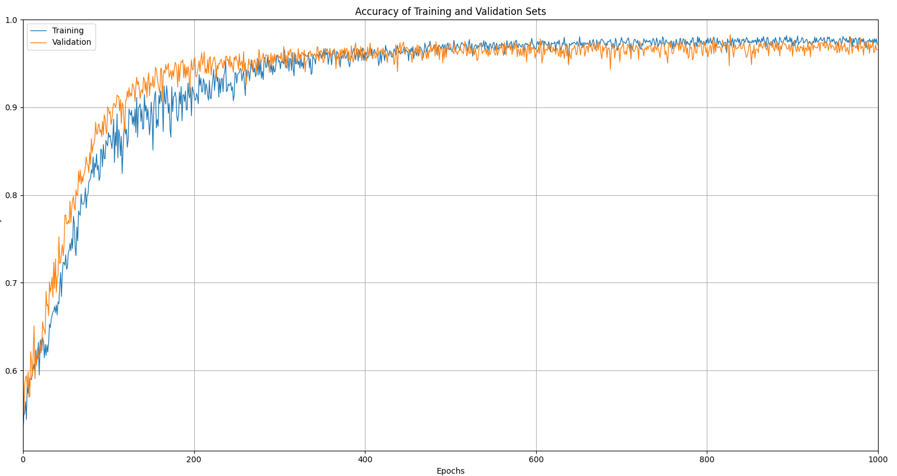
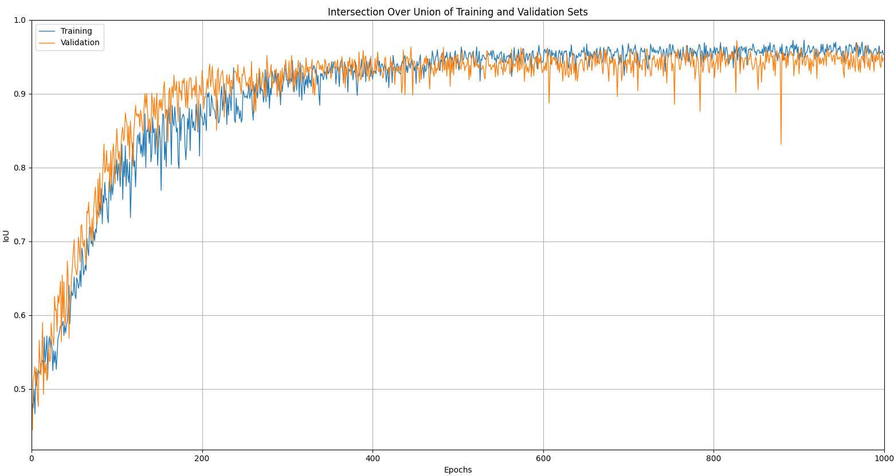
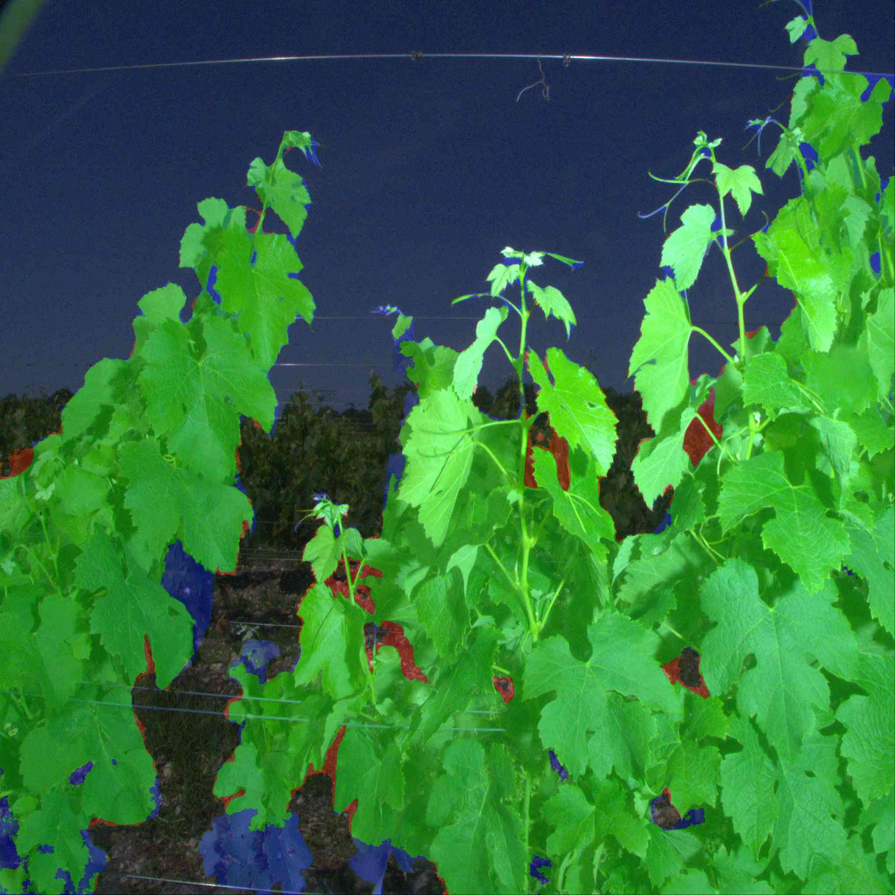
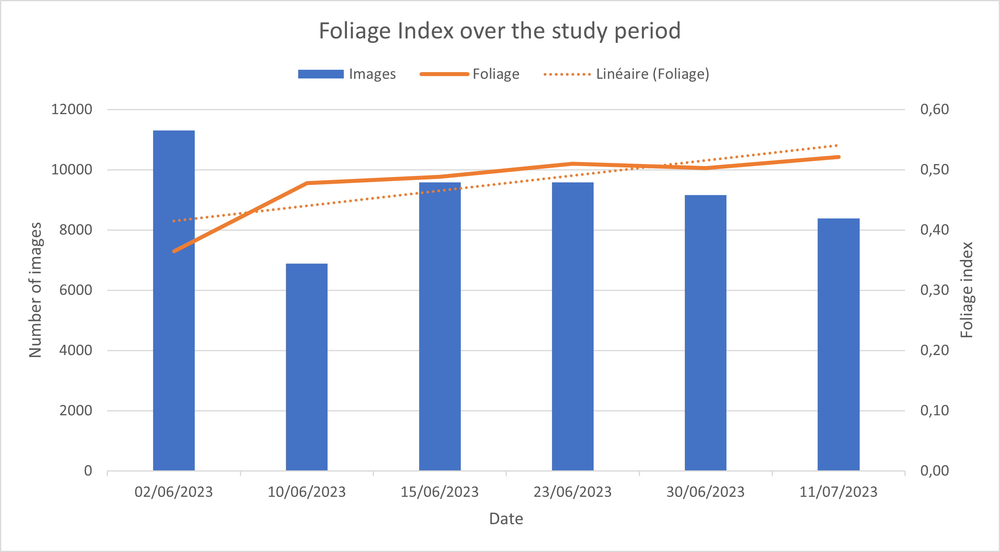

# Entrainement
Dans l'article précèdent, nous avons vu que le meilleur modèle était celui avec les images de taille 512x512 pixels. Nous l'avons donc entrainé sur 1000 époques avec un taux d'apprentissage de 0.00001. Nous avons obtenu les résultats suivants :

Les courbes montre un augmentation rapide de la préçision ainsi que de l'IoU lors des premières époques (de 0 à 200). Cela indique que le modèle a rapidement appris à identifier les feuilles de vignes. On observe ensuite unne évolution plus lente qui indique que le modèle a atteint un certain niveau de performance et qu'un entrainement plus long ne permettra pas d'améliorer les résultats. De plus, on remarque un écart progressif entre l'entrainement et la validation, la courbe d'entraînement surpasse celle de la validation à partir de 500 époques. Ce qui démontre un léger surapprentissage du modèle.

# Test
Nous avons ensuite testé le modèle sur une quarantaine d'images. Les résultats sont les suivants :

La zone en verte est la zone correctement prédite, la zone en rouge est la zone prédite mais qui ne correspond pas à une feuille de vigne et la zone en bleu est la zone qui correspond à une feuille de vigne mais qui n'a pas été prédite par le modèle. On remarque les vrais positifs (en vert) sont très nombreux et que les zones bleu sont souvent dû à des imprécisions sur les vrais masques.

# Acquisitions 
Au total, 6 acquisitions ont été réalisées. Ce qui permet d'étudier l'évolution de l'indice de feuillage au cours de la saison.

Sur ce graphique, on remarque que l'indice de feuillage augmente au cours des acquisitions. Cela provient du fait que les feuilles de vignes se développent entre avril et juillet. Cependant ce graphique n'est pas très fiable car les conditions d'acquisitions ne sont pas constantes. Par exemple la luminosité n'est pas la même sur toutes les images. De plus, le nombre d'images par acquisition n'est pas constant. Enfin, certaines images sont en quelques sortes des doublons car le robot n'avançait pas ou pas assez vite pour que les images soient différentes.

Pour avoir un rendu plus préçis, il est nécessaire d'utiliser les positions GPS des images afin de les replacer sur une carte et de rassembler les images par pied de vigne. Cela permettra d'éviter les doublons et de pouvoir comparer les indices de feuillage sur une parcelle de vigne.
