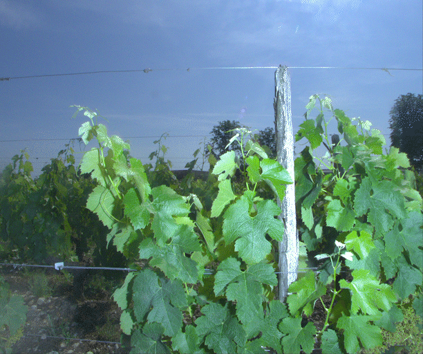

## Scout X
Un robot conçu pour l'acquisition d'images de vignes. Il est équipé de tout un arsenal de capteurs, dont une caméra RealSense, une caméra RGB, un GNSS, un Lidar, un mini ordinateur (Nvidia Xavier) dans le but de le rendre autonome.

## Acquisitions d'images
Le Scout X a été équipé d'appareils d'acquisition d'images de haute qualité, avec des caméras industrielles ainsi que des flashs xenon. Grâce à ces équipements, il est possible de réaliser des acquisitions d'images en pleine journée. Les appareils d'acquisitions sont controlés par un mini ordinateur, qui permet de les synchroniser et de les déclencher à distance ou bien de lancer des acquisitions automatiques à intervalles réguliers.
Voici une suite d'images acquises par le Scout X :
